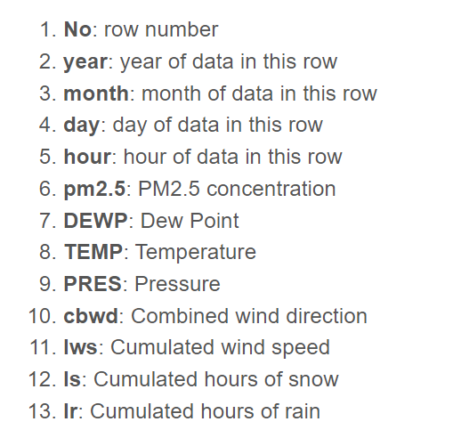
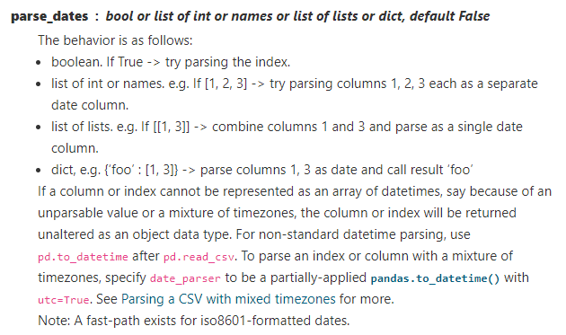
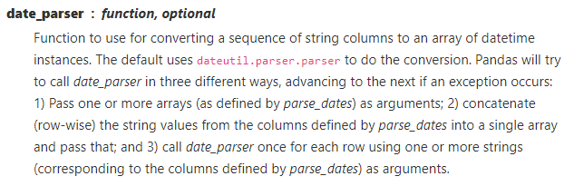

# LSTM-Tutorial
原网址：https://machinelearningmastery.com/multivariate-time-series-forecasting-lstms-keras/

初学序列模型，找了个tutorial来练习。

---
## Python环境

- Python 3.6（使用Anaconda）
- keras 2.6
- tensorflow 2.6.0
- jupyter
- scikit-learn, Pandas, NumPy and Matplotlib
- 杂七杂八的库

---
## Tutorial Overview

1. Air Pollution Forecasting
2. Basic Data Preparation
3. Multivariate LSTM Forecast Model 
   1. LSTM Data Preparation 
   2. Define and Fit Model 
   3. Evaluate Model 
   4. Complete Example
4. Train On Multiple Lag Timesteps Example

---

## 1. 空气污染预测

数据集链接：https://raw.githubusercontent.com/jbrownlee/Datasets/master/pollution.csv
下载到根目录下并重命名为raw.csv

具体的feature如下：

## 2. 准备基本数据

原始数据的时间信息要组合成一个时间戳，这样可以在Pandas里面把它用作index。

看一眼原始数据会发现前几行数据里的PM2.5的值是NA，所以把前几行去除。数据中还有零散的NA，目前我们把它看作0值。

pandas的read_csv的参数：

经处理完的数据通过matplotlib画出来